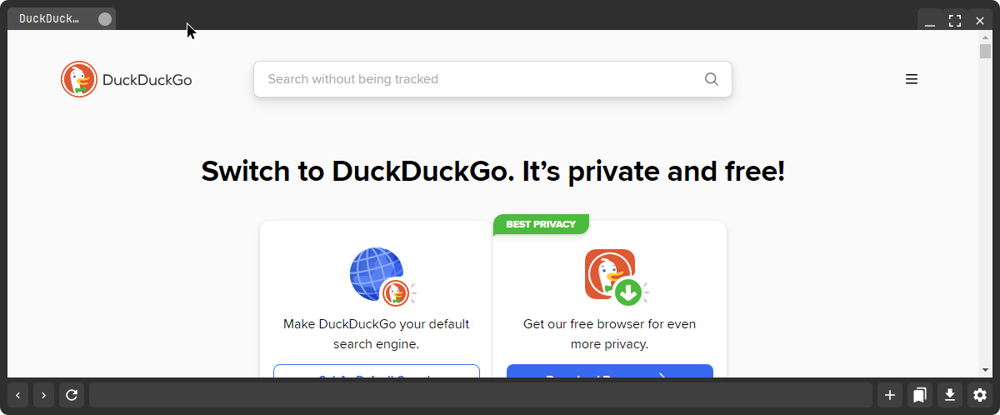

# A browser

A lightweight web browser built with PyQt5 featuring custom DNS settings, search engine customization, and bookmark management.



## Features

- **Multiple Tabs**: Browse multiple websites simultaneously with a tabbed interface
- **Bookmarks Management**: Save and organize your favorite websites
- **History Tracking**: Keep track of your browsing history
- **DNS Configuration**: Customize DNS settings for enhanced privacy or performance
- **Search Engine Selection**: Choose and switch between different search engines

## Requirements

- Python 3.x
- Dependencies listed in `requirements.txt`

## Installation

1. Clone the repository:
```bash
git clone https://github.com/yourusername/pyqt-web-browser.git
cd pyqt-web-browser
```

2. Install the required dependencies:
```bash
pip install -r requirements.txt
```

3. Run the browser:
```bash
python main.py
```

## Usage

### Basic Navigation
- Use the address bar to enter URLs or search terms
- Click `+` to open a new tab
- Right-click on tabs for additional options

### Customization
1. **DNS Settings**
   - Access DNS settings from the menu
   - Enter custom DNS server addresses
   - Apply changes for immediate effect

2. **Search Engines**
   - Open settings menu
   - Select from available search engines
   - Add custom search engines with their URL templates

3. **Bookmarks**
   - Click the star icon to bookmark current page
   - Access bookmarks from the menu bar
   - Organize bookmarks with folders

## Contributing

Contributions are welcome! Please feel free to submit a Pull Request.

## License

This project is licensed under the WTFPL License.

## Acknowledgments

- Built with [PyQt5](https://www.riverbankcomputing.com/software/pyqt/)
- Uses [QtWebEngine](https://doc.qt.io/qt-5/qtwebengine-index.html) for web rendering

## Disclaimer

This is a personal project intended for learning purposes. Please review the code and use at your own discretion.
